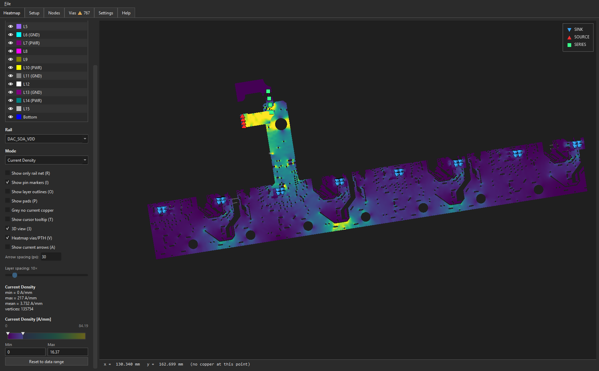

# FYPA - FEM Y-parameter Power Analyser

Power-Delivery-Network (PDN) analysis for Altium PCB designs. Extracts copper
geometry directly from a `.PrjPcb` project, runs a 2-D FEM Laplace solver per
copper layer to compute voltage drop and current density across power rails,
and visualises the result in a custom OpenGL viewer with per-vertex shading.

**Name:** *FYPA* stands for **F**EM **Y**-parameter **P**ower **A**nalyser —
the tool extracts the admittance (Y-parameter) matrix of each copper layer
via a finite-element solve, then uses it to compute steady-state voltage,
current density, and power dissipation across the PDN.

Based on [padne](https://github.com/atx/padne) (the FEM solver) and uses
[altium_monkey](https://github.com/wavenumber-eng/altium_monkey) to read the
Altium project files.

> **Disclaimer:** FYPA is a design-aid tool. Treat its results as guidance
> and validate against measurement.



## What it does

You annotate components in your Altium schematic with a small set of
`PDN_*` parameters (which net is the input, which is the output, the current
or voltage), point this tool at the `.PrjPcb`, and it:

1. Extracts every copper feature (tracks, arcs, regions, pads, vias) along
   with the net assignments.
2. Builds a per-(physical-layer, net) 2-D geometry from the Shapely union of
   all copper for that net on that layer.
3. Triangulates each layer and runs a sparse-direct FEM Laplace solve.
4. Solves for the voltage field, current density `|J|`, and power-density
   on every node.
5. Opens an interactive GPU-accelerated viewer where you can:
   - Switch layers / rails / display modes (Voltage / Voltage Drop /
     Current Density / Power Density)
   - Pan and zoom natively on the GPU (no rasterisation; pixel-sharp at
     every zoom level)
   - Drag handles or type values to clamp the colour scale
   - Hover for a probe readout
   - Cross-check per-pin voltages and per-via currents in sortable tables

## Download (prebuilt Windows binary)

If you just want to run the tool — no Python install, no git clone — grab the
latest packaged build from the
[Releases page](https://github.com/cutreedesigns/FYPA/releases/latest):

1. Download `FYPA_v<version>.zip` from the latest release's *Assets*.
2. Extract it anywhere permanent (e.g. `C:\Tools\FYPA\`).
3. Double-click `FYPA.exe` inside the extracted folder.

On first launch Windows SmartScreen will show a blue warning — click
**"More info"** then **"Run anyway"** (the exe is unsigned; this is a
one-time prompt per machine).

> **Keep `FYPA.exe` and the `_internal\` folder together** — moving the exe
> alone will break it. Create a desktop shortcut rather than moving the exe.

To build the executable yourself, see
[Building a standalone executable](#building-a-standalone-executable).

## Installation (from source)

This project depends on `altium_monkey` (a git submodule) and a handful of
PyPI packages. Clone with `--recursive` to pull the submodule in one go:

```sh
git clone --recursive git@github.com:cutreedesigns/FYPA.git
cd FYPA
```

If you cloned without `--recursive`, run:

```sh
git submodule update --init --recursive
```

Set up a virtual environment and install the Python dependencies.

> **Python version: 3.11 or 3.12 only.** The `altium_monkey` submodule pins
> `requires-python = ">=3.11,<3.13"`, and its `numpy==2.2.3` dependency
> does not yet ship wheels for 3.13/3.14. Python 3.11 is the tested version;
> 3.12 also works. On Windows, install Python 3.12 from
> [python.org](https://www.python.org/downloads/) or via
> `winget install Python.Python.3.12`, then create the venv with the `py`
> launcher to pick the right interpreter:

```sh
py -3.12 -m venv .venv             # or: py -3.11 -m venv .venv
.venv\Scripts\activate             # PowerShell: .venv\Scripts\Activate.ps1
pip install -e altium_monkey
pip install -r requirements.txt
```

`PyOpenGL` and `PyOpenGL_accelerate` are required for the GPU viewer.

## Usage

Annotate your Altium schematic with `PDN_*` parameters on the components that
define the power-delivery topology:

| Role         | Required parameters                                                                                     | What it means                                                         |
|--------------|---------------------------------------------------------------------------------------------------------|-----------------------------------------------------------------------|
| `SOURCE`     | `PDN_V`, `PDN_P_NET`, `PDN_N_NET` — *or* `PDN_V`, `PDN_NET`                                              | Voltage source between the two nets (e.g. a connector pin)            |
| `SINK`       | `PDN_I`, `PDN_P_NET`, `PDN_N_NET` — *or* `PDN_I`, `PDN_NET`                                              | Current sink between the two nets (e.g. an IC load)                   |
| `SERIES`     | `PDN_R`, `PDN_P_NET`\*, `PDN_N_NET`\*                                                                   | Series resistance / fuse / ferrite / inductor DCR (rail bridge)       |
| `REGULATOR`  | `PDN_V`, `PDN_GAIN`, `PDN_OUT_P_NET`, `PDN_OUT_N_NET`, `PDN_IN_P_NET`, `PDN_IN_N_NET`                   | On-board regulator (LDO / buck) — models BOTH input and output rails  |

\* `PDN_P_NET` and `PDN_N_NET` are optional for `SERIES` on a 2-pin part — the
tool auto-infers them from the component's pad connectivity.

Add `PDN_ROLE` on the component (e.g. `PDN_ROLE=SOURCE`) and the required parameters for that role. 
For 2-pin parts the tool can auto-infer `PDN_P_NET` /
`PDN_N_NET` from connectivity; for ICs you'll need to set them explicitly.

### Single-net (point-to-point) check — `PDN_NET`

Sometimes a net has no return reference at all — tracing power from a
connector to a high-side switch, say, where the switch has only a supply
pin. For that case give a `SOURCE`/`SINK` a single `PDN_NET` instead of the
`PDN_P_NET` / `PDN_N_NET` pair:

```text
J1 (connector feeding VBATT):     U3 (high-side switch input):
  PDN_ROLE = SOURCE                 PDN_ROLE = SINK
  PDN_V    = 12V                    PDN_I    = 5A
  PDN_NET  = VBATT                  PDN_NET  = VBATT
```

The directive then has one terminal on PCB copper; its other terminal is an
ideal 0 Ω return, so the result reflects only that net's copper voltage drop
— the point-to-point IR drop you're after. (`PDN_PINS` overrides the pad set,
the way `PDN_P_PINS` / `PDN_N_PINS` do for two-terminal directives.)

Rules:

- `PDN_NET` and `PDN_P_NET` / `PDN_N_NET` are mutually exclusive on one
  directive — giving both, or neither, is an error.
- A single-net analysis still needs a closed loop: at least one `SOURCE`
  **and** one `SINK` on the same net (a lone one is an "open loop" error).
- Single-net mode is `SOURCE` / `SINK` only — `SERIES` bridges two nets and
  `REGULATOR` has four terminals.
- Every `SOURCE` and `SINK` that shares a net must use the same mode; a group
  can't mix single-net and two-terminal directives. Independent groups may
  use different modes in the same solve.


### Multi-channel SOURCE / SINK

`SOURCE` and `SINK` roles support multiple independent channels on a single
part — useful for an IC with several supply pins, each on its own rail.
Channels are addressed by appending a positive integer to `PDN` in the
parameter prefix:

| Channel | Value param | Net params                            |
|---------|-------------|---------------------------------------|
| legacy  | `PDN_V`/`PDN_I`   | `PDN_P_NET`, `PDN_N_NET` (or `PDN_NET`)   |
| 1       | `PDN1_V`/`PDN1_I` | `PDN1_P_NET`, `PDN1_N_NET` (or `PDN1_NET`) |
| 2       | `PDN2_V`/`PDN2_I` | `PDN2_P_NET`, `PDN2_N_NET` (or `PDN2_NET`) |
| …       | …                 | …                                     |

The legacy unindexed channel and any number of indexed channels coexist
as independent directives. Indices are sparse — gaps are allowed (e.g.
just `PDN_V` + `PDN2_V`). A channel is "present" iff its value parameter
is set; the per-channel `*_NET` and `*_PINS` parameters use the matching
index. The part-wide `PDN_ROLE` applies to every channel.

Example — a SINK with three independent supply rails:

```text
U7 (multi-rail IC load):
  PDN_ROLE   = SINK
  PDN_I      = 500mA     PDN_P_NET  = +3V3   PDN_N_NET  = GND
  PDN1_I     = 250mA     PDN1_P_NET = +1V8   PDN1_N_NET = GND
  PDN2_I     = 50mA      PDN2_P_NET = +5V    PDN2_N_NET = GND
```

The Setup tab and the Pins-tab table label indexed channels as
`U7#1`, `U7#2` so they're easy to tell apart from the legacy `U7` channel.

`SERIES` and `REGULATOR` ignore the index suffix and behave as
single-channel directives.

### `SOURCE` vs `REGULATOR` — when to use which

A `SOURCE` represents a supply *edge* — the voltage just appears on the
specified net and the solver assumes whatever is upstream of it is infinite.
Use it for a connector pin, a battery terminal, or any spot where you don't
care what's upstream.

A `REGULATOR` represents an *on-board regulator* (LDO, buck, etc.) — it
pins its output net at `PDN_V` AND pulls current from its input net
proportional to the output current. Use it when both the input AND the
output rail are part of the PDN you're analyzing, so you can see the
voltage drop the regulator causes on its input side too.

`PDN_GAIN` is the input-current / output-current ratio:

| Regulator type            | Suggested `PDN_GAIN`              |
|---------------------------|-----------------------------------|
| LDO                       | `1.0` (current passes straight through) |
| 100%-efficient buck       | `Vout / Vin` (e.g. 3V3 from 5V → `0.66`) |
| 90%-efficient buck        | `(Vout / Vin) / 0.9` (e.g. → `0.73`)    |

Worked example — a board with a 5V connector input feeding a 3V3 LDO:

```text
J1 (input connector):
  PDN_ROLE   = SOURCE
  PDN_V      = 5
  PDN_P_NET  = +5V
  PDN_N_NET  = 0V

U2 (3V3 LDO):
  PDN_ROLE      = REGULATOR
  PDN_V         = 3.3
  PDN_GAIN      = 1.0
  PDN_OUT_P_NET = +3V3
  PDN_OUT_N_NET = 0V
  PDN_IN_P_NET  = +5V
  PDN_IN_N_NET  = 0V

U5 (3V3 load — your IC):
  PDN_ROLE  = SINK
  PDN_I     = 500mA
  PDN_P_NET = +3V3
  PDN_N_NET = 0V
```

With this setup the solver models 500 mA flowing from `+3V3` into U5
(showing drop on the +3V3 copper between U2 and U5) AND 500 mA being
drawn from `+5V` into U2 (showing drop on the +5V copper between J1
and U2). Replacing U2 with a `SOURCE` would zero out that second drop
because no current would flow through the +5V copper.

If every rail on your board comes in pre-regulated (no on-board
regulators), you'll never need `REGULATOR` — `SOURCE` for inputs and
`SINK` for loads is the whole story.

Then run the all-in-one solve + viewer:

```sh
python FYPA.py gui path\to\YourBoard.PrjPcb
```

Or use the individual subcommands:

```sh
python FYPA.py extract     YourBoard.PrjPcb           # raw record summary
python FYPA.py annotations YourBoard.PrjPcb           # parsed PDN_* directives
python FYPA.py geometry    YourBoard.PrjPcb           # per-layer copper summary
python FYPA.py load        YourBoard.PrjPcb           # full pipeline, readiness report
python FYPA.py solve       YourBoard.PrjPcb out.pkl   # solve + pickle
python FYPA.py show        out.pkl                    # open viewer on a saved pickle
python FYPA.py paraview    out.pkl out.vtu            # export to ParaView VTK
```

### Solve cache

On the first run it solves the
FEM and saves the result to `FYPA/.cache/<project>_<hash>.pkl`
along with a fingerprint of every input that affects the solve:

* The `.PrjPcb` plus every `.PcbDoc` / `.SchDoc` it references
  (parsed from the `DocumentPath=` lines)
* The tool's own solver-affecting source files (`fypa/altium_extract.py`,
  `fypa/altium_annotations.py`, `fypa/altium_geometry.py`,
  `fypa/altium_loader.py`, `fypa/cli.py`, `fypa/lean_solution.py`, and the
  modified `pdnsolver/` modules)

On subsequent runs the fingerprint is recomputed and compared. If
nothing has changed the cached solution is reused — typical startup
drops from ~10–60 s (full solve) to under a second. Editing any
referenced PCB / Sch file or any of the tool's source files
automatically invalidates the cache.

To force a fresh solve, pass `--no-cache`:

```sh
python FYPA.py gui YourBoard.PrjPcb --no-cache
```

To clear all cached solutions, delete the `.cache/` directory inside
the tool folder — they'll regenerate on the next run.

### Launching directly from Altium

A small DelphiScript ([Run_FYPA.pas](packaging/Run_FYPA.pas)) is bundled
that fires the tool against whichever `.PrjPcb` is focused in Altium —
no need to copy paths to a console. One-time setup:

1. **Point the script at this directory.** Open `packaging/Run_FYPA.pas`
   in a text editor and check the `SCRIPT_DIR` constant near the top:
   ```pascal
   SCRIPT_DIR = 'C:\path\to\FYPA';
   ```
   Change it to wherever you cloned the repo. The script expects to find
   `<SCRIPT_DIR>\.venv\Scripts\python.exe` and
   `<SCRIPT_DIR>\FYPA.py`, so the venv from
   [Installation](#installation) needs to live inside that directory.

2. **Optionally change the subcommand** via the `SUBCOMMAND` constant.
   Defaults to `gui` (solve + open viewer). Set to `load` for a
   solve-readiness report, `annotations` to dump the parsed `PDN_*`
   directives, `extract` for a raw-record summary, etc.

3. **Register the script in Altium.** *DXP > Scripting System > Script
   Projects*, add a new script project (or open an existing one) and
   add `packaging/Run_FYPA.pas` to it.

4. **Run it.** With a `.PrjPcb` open and focused in the *Projects*
   panel, right-click the `Run` procedure in the Script Editor and
   choose *"Run Script"*. A console window opens and runs:
   ```
   <SCRIPT_DIR>\.venv\Scripts\python.exe FYPA.py gui <FocusedPrjPcb>
   ```
   The console stays open after Python exits (uses `cmd /K`) so any
   tracebacks are readable. Close the console window when you're done.

The script will surface a clear `ShowError` dialog if any prerequisite
is missing — wrong path, no project open, project unsaved, or the
focused project isn't a `.PrjPcb`.

## Building a standalone executable

The project can be packaged into a self-contained Windows folder using
[PyInstaller](https://pyinstaller.org). The recipient needs no Python
installation — they just extract a zip and double-click the `.exe`.

### Prerequisites

PyInstaller is not listed in `requirements.txt` because it is only needed
by whoever is doing the build, not by users of the tool. Install it once
into the project venv:

```sh
.venv\Scripts\activate
pip install pyinstaller
```

### Building

From the project root, double-click **`packaging\build_dist.bat`** (or run
it from a terminal). It will:

1. Activate the venv
2. Auto-install PyInstaller if it is not already present
3. Wipe any previous `build/` and `dist/` folders
4. Run `pyinstaller packaging\FYPA.spec`
5. Copy `README.md` into the staged output so it travels with the bundle
6. Delete the intermediate `build/` folder
7. Zip the staged `dist\FYPA\` folder into a single distributable archive
8. Delete the unzipped staging folder so only the zip remains in `dist\`

The first build takes 3–5 minutes while PyInstaller scans all packages.
Subsequent builds are quicker. The final artefact is:

```
dist\
  FYPA.zip          ← share this single file
```

Inside the zip:

```
FYPA\
  FYPA.exe
  README.md
  _internal\
    [DLLs, .pyd files, Python runtime, ...]
    assets\
```

### Distributing

The standard distribution channel is **GitHub Releases** — tag a version
(e.g. `v0.02`), draft a release on GitHub, and upload `dist\FYPA.zip`
(rename it to include the version, e.g. `FYPA_v0.02.zip`) as a release
asset. Users follow the
[Download (prebuilt Windows binary)](#download-prebuilt-windows-binary)
instructions above.

The zip can also be sent directly if you don't want to publish a release.

Cached solves (`.cache\`) are written next to `FYPA.exe`, so they survive
re-extracting a new build over the old folder.

### Customising the build

All PyInstaller settings live in **`packaging\FYPA.spec`**. Notable options:

| Setting | Default | Notes |
|---|---|---|
| `console=True` | `True` | Shows a terminal window — keeps CLI subcommands usable and errors visible on crash. Set to `False` for a GUI-only distribution with no console. |
| `datas` | `assets` | Add extra data files/folders here if needed. |
| `hiddenimports` | PyOpenGL, PySide6 GL, scipy, matplotlib | Extend if the app crashes on launch with `ModuleNotFoundError` — add the missing module name here. |
| `excludes` | `tkinter`, `cadquery`/`OCP`/`vtk`/`casadi`, unused PySide6 modules | Trims ~400 MB by dropping the `altium_monkey` STEP-bounds 3D stack (only used by write-side helpers FYPA never calls) and QML/PDF Qt modules. Extend if you find more bloat. |

After editing the spec, re-run `packaging\build_dist.bat` to rebuild.

## Architecture

```
FYPA.py                  Thin launcher shim (repo root)
fypa/                    Application package:
  cli.py                 CLI entry; orchestrates the pipeline
  altium_extract.py      altium_monkey adapter → typed dataclasses (mm-based)
  altium_annotations.py  Parses PDN_* parameters, resolves terminal pins
  altium_geometry.py     Builds per-(layer, net) Shapely MultiPolygons
  altium_loader.py       Orchestrator; assembles the padne Problem
  altium_viewer.py       Qt viewer (side panel, tabs, scale controller)
  gl_mesh_viewer.py      Custom QOpenGLWidget — mesh-on-GPU heatmap canvas
  lean_solution.py       Compact numeric solution (cache / pickle payload)
pdnsolver/               Vendored fork of padne (FEM solver + mesher)
altium_monkey/           Submodule — Altium project parser
packaging/               PyInstaller spec, build script, Altium launcher
```

## How the GL viewer works

The FEM triangle mesh (vertices, indices, per-vertex scalar values) lives
in OpenGL vertex / index / value buffers. The vertex shader applies a
model-view-projection matrix and normalises the per-vertex value into
`[0, 1]` using current `vmin`/`vmax` uniforms; the fragment shader looks
up the colour from a 1-D RGBA8 LUT texture (sampled from matplotlib's
`viridis`).

Pan / zoom are pure matrix uniform updates. Colour-scale drag is a uniform
update. Layer / rail / mode changes are a re-upload of the value VBO only
(positions and indices are unchanged within a layer/rail). The CPU keeps a
matplotlib `LinearTriInterpolator` alongside for the hover-probe lookup and
Voltage Drop reference computation, but never touches the GPU rendering
path.

Marker overlays (SOURCE / SINK / SERIES / REGULATOR / VIA) and the title /
legend chips are drawn via `QPainter` inside `paintGL` so they share the
GL paint engine — no Qt raster-fallback compositor.

## License

AGPL-3.0-or-later. See [LICENSE](LICENSE) and [NOTICE](NOTICE) for upstream
attributions. The vendored padne fork's modifications are documented in
[pdnsolver/CHANGES.md](pdnsolver/CHANGES.md).
